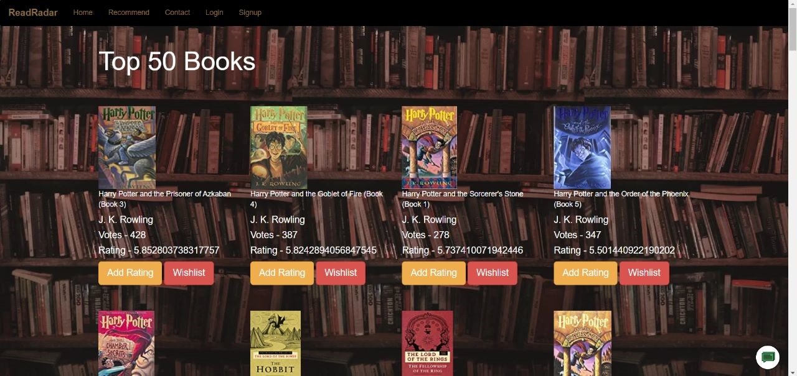
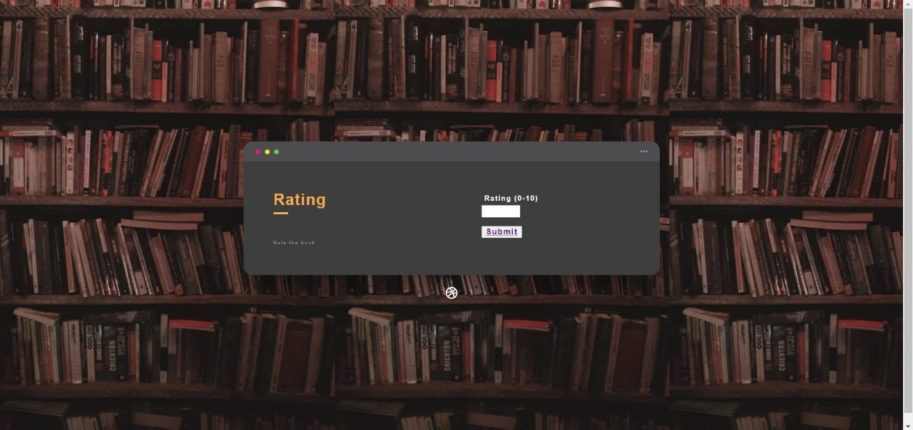
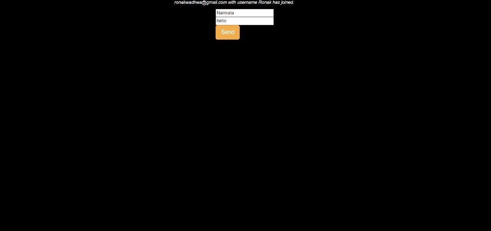

# ReadRadar

A book recommendation system which will help users to recommend few books related to the searched topic.

## Table of Contents

- [Features](#features)
- [Getting Started](#getting-started)
- [Prerequisites](#prerequisites)
- [Usage](#usage)
- [Screenshots](#screenshots)

## Features

- **Wishlist**: Users can wishlist any book they want.
- **Chat Section**: Users can share their opinions on books in our chat section.
- **Ratings**: Users can rate the book they are reading which will help other users to get the idea about the book.
- **User-Friendly Interface**: Intuitive and easy-to-use UI.

## Getting Started

Follow these instructions to get the project up and running on your local machine.

## Prerequisites

Hardware:
Intel core i3 4600 or Ryzen 3 1200 or newer
4GB RAM
Stable internet connection

Software:
Windows 7,  Linux mint 16,  Mac OS X Yosemite or newer

## Usage

1. Launch the application.
2. Search for the book you want to read
3. Check all the info about the book
4. Rate the book if you want
5. Discuss about the book in our chat section

## Screenshots
Home Page:

Recommend page:

Rating page:

Chat section:

